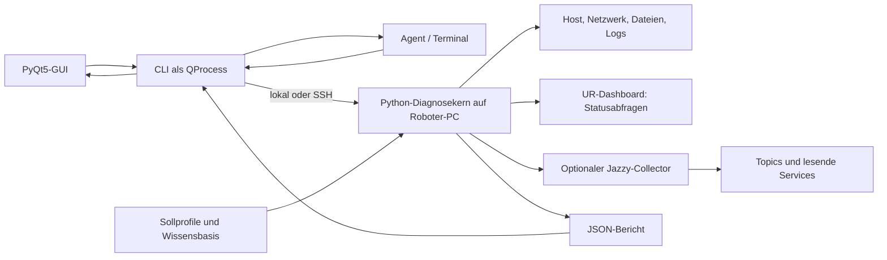

# Architektur

Ein Diagnosekern erzeugt versionierte Berichte für CLI, GUI und Agenten. Hardwareprüfungen laufen auf dem ausgewählten Roboter-PC. Die Oberfläche benötigt dadurch weder ROS auf dem Laptop noch direkten Zugang zum internen Roboternetz.

## Komponenten und Ausführung

Der Kern verwendet die Python-Standardbibliothek. Host-, Dashboard- und Integrationsprüfungen werden mit begrenzten Laufzeiten gesammelt; der ROS-Collector läuft als separater Prozess unter dem System-Python. Vorhandene Jazzy-/Workspace-Setups werden nur für diesen Prozess eingelesen. Die Engine wählt dessen Domain ausdrücklich über `--domain-id` oder den Profilstandard 62; die direkte Collector-API ohne Domainparameter behält die tatsächliche Umgebung bei. Fehlende ROS-Komponenten erzeugen `unknown` und verhindern keine unabhängigen Prüfungen.

SSH nutzt vorhandene Schlüssel und `known_hosts` ohne interaktive Passwortabfrage. Auf dem Ziel läuft der installierte Diagnosekern mit `--via local`. Der Resolver berücksichtigt den normalen PATH, `~/.local/bin/mur-diagnostics` und die üblichen Colcon-Installationspfade; beim Colcon-Einstieg wird das vorhandene Workspace-Setup eingelesen. Der lokale Hostname wird vor internen Hardwareprüfungen gegen das physische Profil geprüft. Der SSH-Aufrufer kontrolliert Berichtsschema, Roboteridentität und Toolversion. Er kopiert oder installiert keinen Code automatisch.

`scan` erzeugt einen Bericht. `watch` liefert einzelne vollständige Berichte als JSONL; langsame Prüfungen begrenzen die tatsächliche Rate. Die GUI liest ausschließlich Prozessausgaben, hält blockierende I/O aus dem Qt-Hauptthread und verwirft Ergebnisse älterer Auswahlgenerationen. Stoppen beendet verwaltete Prozesse. Nach einem Zielwechsel werden Daten und Nutzerangaben der bisherigen Sitzung entfernt.

## Beobachtungsdomain und Umgebung

Die CLI und das GUI-Feld „ROS-Domain“ wählen die Domain des isolierten Beobachtungsprozesses (0–232, Profilstandard 62). Ursprüngliche Sitzungsumgebung, gewählte Beobachtungsdomain und soweit lesbar ermittelte Domains laufender Treiber sind verschiedene Quellen und werden getrennt ausgewiesen. Die Beobachtungswahl schreibt keine Umgebungsdatei und konfiguriert keinen laufenden Treiber um.

Eine nicht gesetzte SSH-Sitzungsvariable bedeutet effektiv Domain 0 für diese Sitzung. Wenn die Treiber unter Domain 62 laufen und der Collector ausdrücklich dort beobachtet, ist diese Kombination allein kein Roboterfehler. Eine unpassende Beobachtungsdomain oder eine belegte Abweichung der Treiberdomain wird separat bewertet. Nicht lesbare Prozessumgebungen sind kein Nachweis einer bestimmten Treiberdomain.

## Bericht und Zustände

Die öffentliche Schnittstelle ist `schema_version: 1` mit `tool_version`, `robot`, `namespace`, `mode`, `target`, `checked_at`, `complete`, `summary`, `counts`, `results`, `stats` und `manual_observations`. Zusätzliche Profilherkunft kann enthalten sein.

Jeder Befund besitzt eine stabile `id`, `component`, `status`, `summary`, `expected`, `actual`, `source`, `observed_at`, `age_seconds`, `evidence`, `causes`, `next_steps` und `knowledge_id`. Statuswerte sind `pass`, `warn`, `fail`, `unknown`, `not_applicable`. Gesamtübersicht und CLI-Exitcode werden aus diesen Ergebnissen berechnet; Menschen und Agenten erhalten dieselbe Bewertung.

`complete` beschreibt, ob alle anwendbaren Prüfungen bewertbar waren. Es bedeutet nicht Fehlerfreiheit: Ein vollständiger Bericht kann bestätigte Fehler enthalten. Ausgefallene Voraussetzungen können abhängige Beobachtungen auf `unknown` reduzieren, während die konkrete Ursache sichtbar bleibt. Nicht zutreffende Hardware wird weder als Fehler noch als fehlende Prüfung gezählt.

Statuskarten enthalten mindestens Text, Quelle und Zeitinformationen; zusätzliche UR-, Batterie- oder Liftwerte bleiben JSON-Daten. Nutzerangaben sind durch `source=user_reported`, Roboter und GUI-Sitzung gekennzeichnet. Sie ergänzen Belege und beeinflussen keine automatische Prüfung.

## Zeit, Frische und Herkunft

`checked_at` ist die Zeit der Berichtserstellung, `observed_at` die Zeit der jeweiligen Beobachtung. Monotone Uhren dienen zur Alterung und Laufzeitbegrenzung innerhalb eines Prozesses; UTC-Zeitpunkte dienen der Zuordnung im Bericht. Wiederverwendete Werte dürfen keine neue Beobachtungszeit erhalten. Historische Logzeilen ohne verlässlich auswertbaren Zeitstempel sind keine aktuellen Fehlernachweise.

Aktuelle Standardgrenzen: MiR-Akku 10 s, MuR-BMS 5 s, Lift-Kommunikation 2 s, Dashboard-/UR-Kommunikation 6 s. UR-Modustopics sind zuverlässige transient-local Änderungsmeldungen; lange unveränderte Werte sind normal. Zusätzliche aktuelle Kommunikation muss ihre Verlässlichkeit bestätigen. Ein alter, zwischengespeichert publizierter Liftwert genügt nicht: Der zusätzliche Ewellix-Diagnosestatus muss einen aktuellen erfolgreichen Hardwarezyklus belegen.

Die Zeitprüfung liest auf dem Roboter und bei SSH-Zugriff auch auf dem GUI-Rechner Chrony-Konfiguration, ausgewählte Quelle, letzte gute Messung und Tracking-Status. Eine zusätzliche SSH-Zeitprobe bewertet die mögliche Uhrdifferenz als Intervall aus zwei lokalen Messzeitpunkten; hohe Netzlaufzeit ergibt `unknown`, keinen erfundenen Pass oder Fehler. Chrony-Daten werden höchstens 60 s verwendet. Die ausdrücklich aufgerufene Administrationshilfe `scripts/configure_chrony.py --apply` gehört nicht zum Diagnosepfad.

Profile trennen physische Identität von ROS-Namespace und vermerken für Sollwerte Herkunft, Quellrevision, Erfassungsdatum und Bestätigungsstatus. Laufzeitabweichungen korrigieren die Profile niemals automatisch. Die mur620c-Liftports sind ausdrücklich vorläufig.

## Erweiterung und Installation

Neue Fehlerfälle werden als Beobachtung plus reine Auswertung ergänzt, mit Wissensartikel und synthetischen Fehler-/Unbekannt-Tests. Grundsätzlich bleiben Datenerfassung, Bewertung und Darstellung getrennt. Keine Reparatur- oder Motion-API wird über die Diagnoseschnittstelle angeboten.

Die einzige notwendige Ergänzung an einem bestehenden Treiber ist separat dokumentiert: [Ewellix-Kommunikationsdiagnose](../../match_mobile_robotics_jazzy/patches/README.md). Patchanwendung, Build und abgestimmter Neustart sind Installationsschritte außerhalb des Diagnosekerns.
